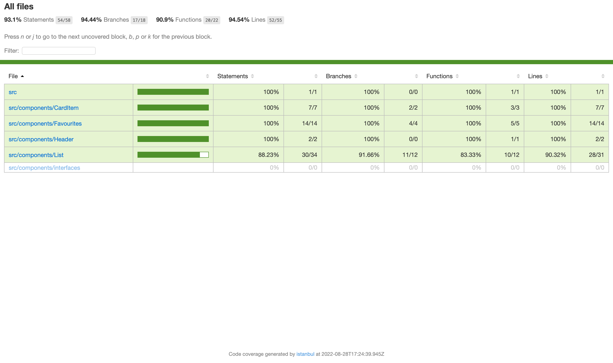

# Getting Started with Beer App

To start using this app in your local, just need to clone the repository in your local and execute:

> npm i

Once if is finished, we should execute:

> npm start

Once compiling finishes, we will be able to see Beer Bad app in our local in http://localhost:3000.

To execute all the tests, just write:

> npm run test

# Libraries of the project

This project was developed with the next technologies.

- Create react app

First, I generated a new project with <strong>create react app</strong> so I could use all the benefits from this framework.

- React-router-dom

Second, I had to install <strong>react-router-dom</strong> library, as I needed to create the proper routing between all the componentes of the application.

- Typescript

Also installed <strong>Typescript</strong> because I think it is really useful in any project as add an extra documentation for the future developers/reviewers and also helps to develop with better standars. I used it in some parts of my code.

Last, but not least important, I used jest to test my functionality. I will talk more deeply about testing later.

# Structure of the project

I created a basic structure for the project, as it is not too much big.

One folder called public where I added the images, and another one, src, where we can difference between services, interfaces and components. 

### Services 

In services we have a file for the unique api calls that we will do: to get beer list.
I used "fetch" as I found the easiest one to use and I didn't have to install anything, but notice that I think axios is better for professional and bigger projects because, for example, has a extensive browser support, and you don't have to convert the response from api to a json object before use it in component.

### Components 

In the components folder, we can find Favourites and the List folders (that could be the Pages) and also the Header, the other another one if for the reusableComponents, but in that case we only have one reusable component, which is the CardItem one.

List is about all the beers that are retrieved from the api call. Here we can see basic information about each beer: Name, picture and attenuation level.

If we click in "Add to favs" we will add the beer to a list.
Notice that when the beer is added, the user is also able to remove it from the list. Alos the style of the button will change, so the user can see quickly if the beer is added or not the list.

If we click on "Go to my Favourite List", we will go to the second component, the one where we can see our selected beers. If any beer was selected, we will see an informational text:

If beers were added, we will see them, and also we will be able to delete them from the list clicking on "Remove from favs".

Also, from here, we can navigate again to the main page, clicking on "Go back to the list".

Also, important to say that App.js file is the one that has the routing logic of the project.

# About State Management 

As you could notice, I decided not to use any kind of state management strategy, like Redux, because its architecture is quite complex for a little project like this and it will not bring any additional value. It is more useful in projects where you have a lot of pages, components and multiple api calls and, of course, when you need frequently access to the store to retrieve those values in your application.

Also, I decided to use local Storage to save the beers selected from user, it is a simple and quickly way to keep this kind of information and access to it from different pages of the application.

# Manageging loadings

When api is loading/pending, I added a simple "Loading" text to be displayed while information is not coming from back end.

# Testing

Final bullet of the list is about testing. I tried to generate as many tests as were useful to prove that the logic of the components is stable and consistent.

For example, for List case, I proved that text is displayed while data is not coming, another one to prove that once we had the information, it its displayed (name, attenuation level, image...), and also one to check about the styles of the button depending on its state.

In Favourites test I tested that when no api is dispatched, we have a informative text, and, once we have the information, it is displayed.
Also, another one to prove logic related to the remove functionality.

In the CardItem test, I tested that all the required props are present in the component, also the functionality related to the onClick on the button and the styles related to the button.

Coverage report image:

>93.% is achived.